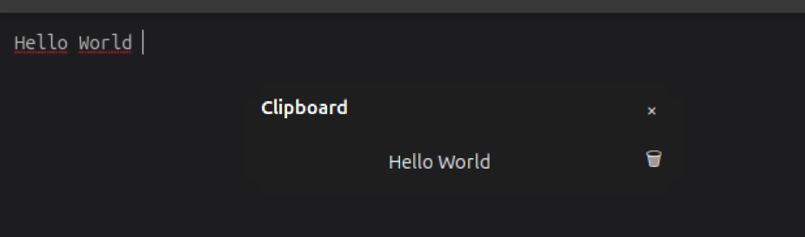

# Clipboard History for GNOME Shell

A Windows-style clipboard history popup for GNOME Shell. Press **Super+V**, pick an entry, and it's pasted straight into whatever you were typing in — no plugins, no daemons, just a small extension.




## Features

- **Super+V** opens a popup with your last 20 copied texts, newest first.
- Click an entry to copy it **and** auto-paste it into the window you were just working in.
- Delete individual entries with the 🗑 button, or close the popup with the × button or a click outside it.
- Popup opens right next to your mouse cursor instead of always in the same spot on screen.
- No dependencies, no background service beyond the extension itself — just GJS and GNOME Shell APIs (`St`, `Clutter`, `Meta`, `GLib`).

## Requirements

- GNOME Shell 50 (tested on Ubuntu 26.04, Wayland).

## Installation

### Manual (from source)

```bash
git clone https://github.com/Diyar1877/gnome-clipboard-history.git
ln -s "$(pwd)/gnome-clipboard-history" ~/.local/share/gnome-shell/extensions/clipboard-history@Diyar1877
glib-compile-schemas ~/.local/share/gnome-shell/extensions/clipboard-history@Diyar1877/schemas
```

Then log out and back in (GNOME Shell only picks up new extension code on relogin, not via `disable`/`enable`), and enable it:

```bash
gnome-extensions enable clipboard-history@Diyar1877
```

### extensions.gnome.org

Submitted and pending review at [extensions.gnome.org](https://extensions.gnome.org).

## Usage

1. Copy some text as usual (Ctrl+C, selection, whatever).
2. Press **Super+V** to open the history popup.
3. Click an entry to paste it into the field you were last using, or click the 🗑 to remove it from history.
4. Press **Super+V** again, click ×, or click outside the popup to close it without pasting.

### Changing the keybinding

The shortcut is stored as a normal GSettings key, so it can be remapped like any other:

```bash
gsettings set org.gnome.shell.extensions.clipboard-history toggle-clipboard-history "['<Super>c']"
```

> Note: by default, `<Super>v` is bound to GNOME's notification tray. Free it up first by rebinding the tray shortcut, e.g.:
>
> ```bash
> gsettings set org.gnome.shell.keybindings toggle-message-tray "['<Super>m']"
> ```

## Known limitations

- History is kept in memory only and is cleared when the extension reloads (logout/login or GNOME Shell restart) — nothing is written to disk.
- No search/filter for long histories yet.

## Contributing

Issues and pull requests are welcome. This started as a learning project, so feedback on GNOME Shell / GJS best practices is especially appreciated.

## License

[MIT](LICENSE)
